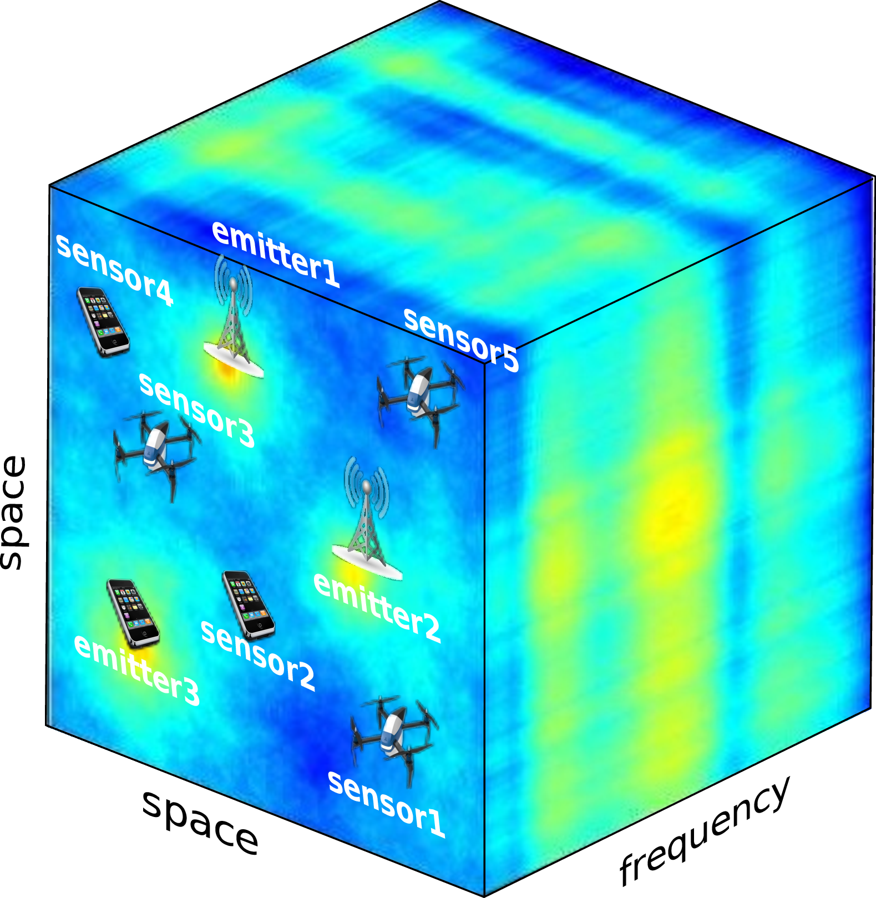
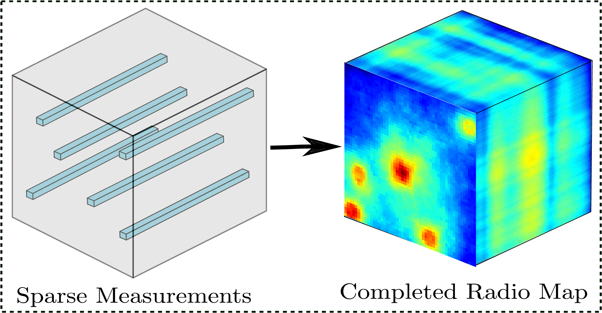
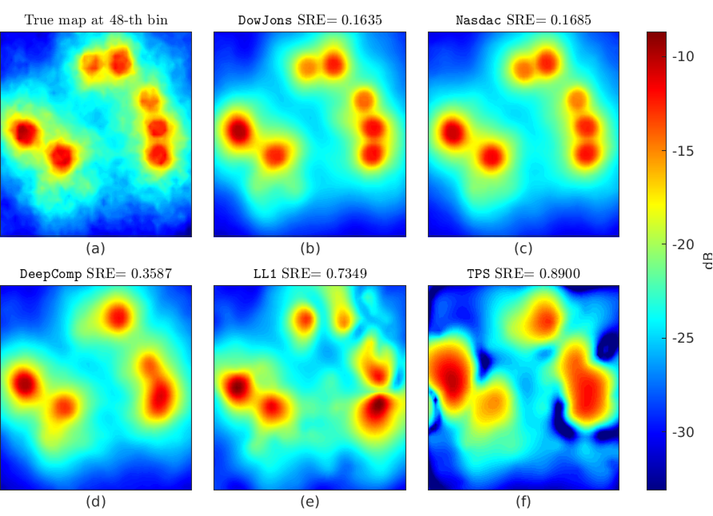
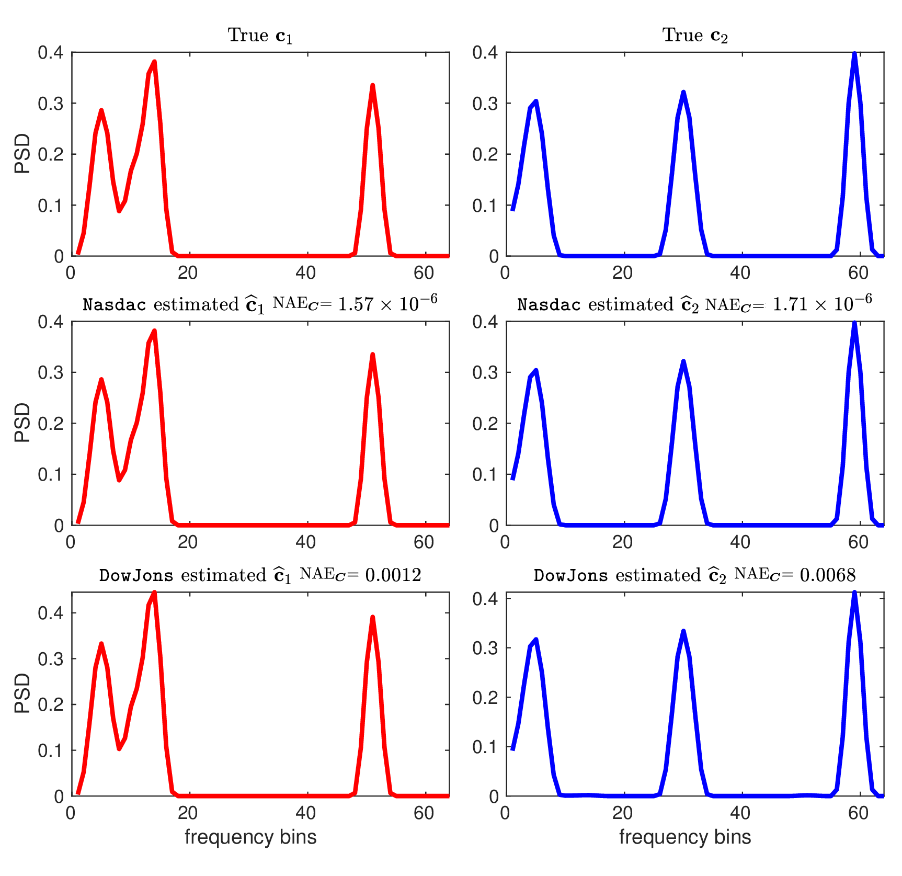
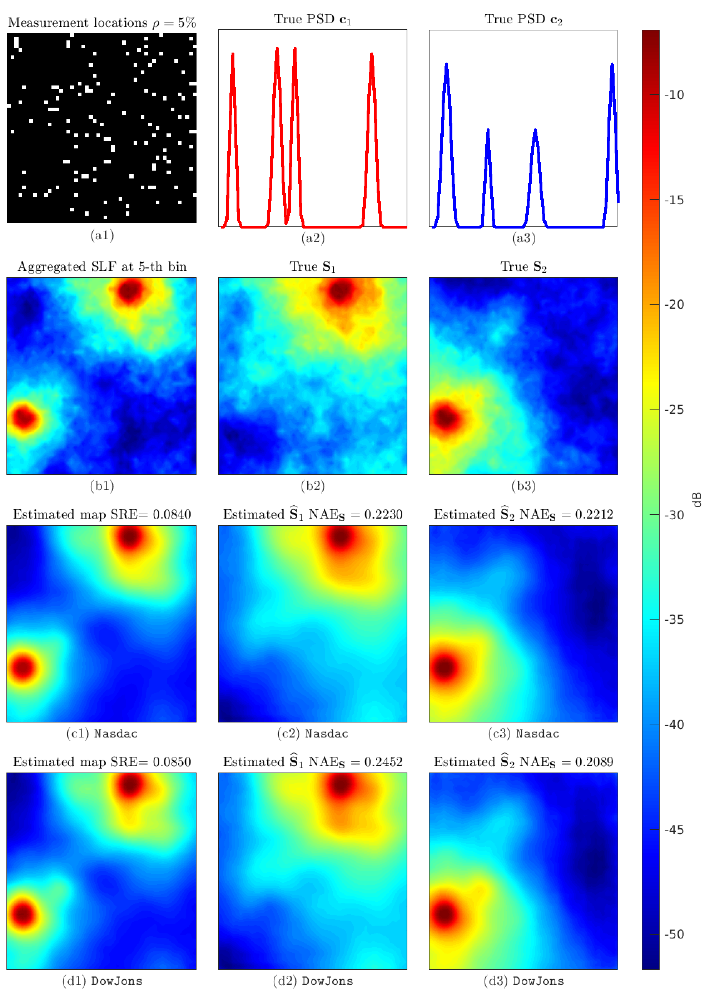

# Deep Spectrum Cartography: Completing Radio Map Tensors Using Learned Neural Model

Implementation of the paper, "[Deep Spectrum Cartography: Completing Radio Map Tensors Using Learned Neural Model](https://ieeexplore.ieee.org/document/9693274)", published in IEEE Transactions on Signal Processing. A shorter, conference version of this paper is published in IEEE ICASSP 2021, available [here](https://ieeexplore.ieee.org/document/9413382).

## Spectrum Cartography (SC) Problem:

<p align='center' style="background-color:white;" >
    
    
    </br>
    </br>
    <figurecaption style='color: black'>[Left] SC environment. [Right] SC task.</figurecaption>
</p>
</br>

## Proposed Method:
<p align='center' style="background-color:white;" >
    
    </br>
    <figurecaption style='color: black'>Radio map model.</figurecaption>
</p>
</br>

<p align='center' style="background-color:white;" >
    
    </br>
    <figurecaption style='color: black'>Method 1: Nonnegative matrix factorization ASsisted Deep emitter spAtial loss Completion (Nasdac) .</figurecaption>
</p>
</br>

<p align='center' style="background-color:white;" >
    
    </br>
    <figurecaption style='color: black'>Method 2: Deep generative priOr With Joint OptimizatioN for Spectrum cartography (Dowjons). 
    </figurecaption>
</p>

## Results:

<p align='center' style="background-color:white;" >
    
    </br>
    <figurecaption style='color: black'>Completed Radio maps using different methods.</figurecaption>
</p>
</br>

<p align='center' style="background-color:white;" >
    
    </br>
    <figurecaption style='color: black'>Recovered PSD by the proposed methods.</figurecaption>
</p>
</br>

<p align='center' style="background-color:white;" >
    
    </br>
    <figurecaption style='color: black'>Recovered SLF by the proposed methods.</figurecaption>
</p>
</br>


## Installation:
The code was built with the `python3.6`, `matlab2020b`, and `torch=1.10.2`

To run the code follow the followign installation instructions:

    1. Install all python packages located in requirements.txt.

    2. Download tensorlab from  https://www.tensorlab.net

    3. Make sure that the above packages are in your environment path.

    4. To interface the python models from matlab use instructions provided here: https://www.mathworks.com/help/matlab/matlab_external/create-object-from-python-class.html.

## Usage:
Sample demonstration of the proposed method in the paper is available in `experiments/demo.m`. 

## Training Deep Prior:
To train a deep prior model follow the following steps:

- Go to `deep_prior/generate_data` and in the `generate_slf.m`, provide destination paths for the training data. Also specify other parameters that suit your need. Then run the script.

- Convert and save the generated matlab tensors as pytorch tensor for faster data loading during training by running the following command from the base directory:
    ```bash
    cd deep_prior
    python convert_to_torch_tensor.py --data_folder <path to the training data> --save_folder <path to save the converted data>
    ```

- Train model by running the following from the base directory
    ```bash
    cd deep_prior
    python train.py --train_data_folder <path to the training data> --validation_data_folder <path to validation data> --model_path <path to save the model> --img_size <length of your radio map region [square region is assumed]>
    ```
The model will be saved in the path provided in `--model_path`.